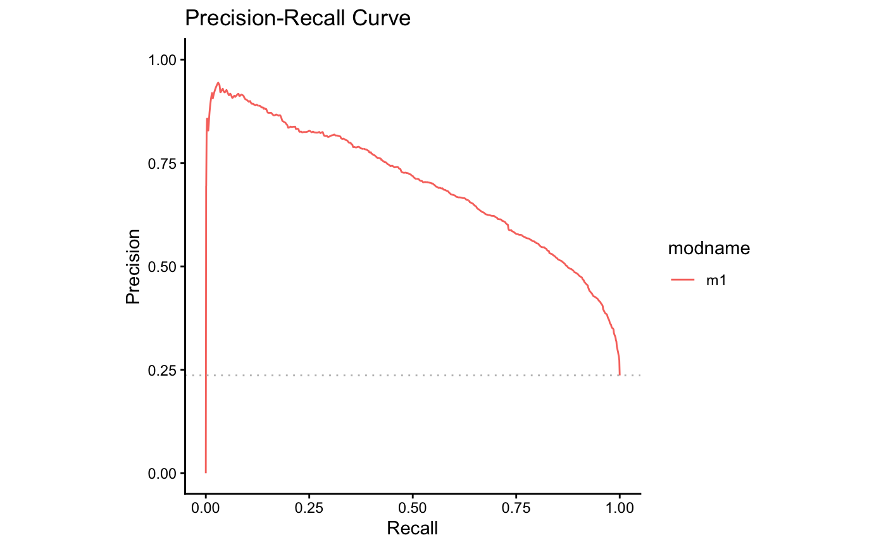

**m6APrediction: Predict m6A Modification Using Random Forest Models**

## Purpose

`m6APrediction` provides utilities to: - encode DNA 5-mers into
per-position factor features; and - predict m6A modification probability
and status using a trained random forest model.

It exposes two user-facing functions: - `prediction_multiple()` for
batch predictions on a data.frame - `prediction_single()` for a single
observation

## Installation

Install from GitHub with either `devtools` or `remotes`. Replace
`username` with your GitHub handle if different.

``` r
# install.packages("devtools")   # if not installed
devtools::install_github("username/m6APrediction")

# or with remotes
# install.packages("remotes")
# remotes::install_github("username/m6APrediction")
```

## Quick start

After installation, load the package and run predictions using the
bundled example model and data in `inst/extdata/`.

``` r
library(m6APrediction)

# Load example model and input data shipped with the package
rf_fit <- readRDS(system.file("extdata", "rf_fit.rds", package = "m6APrediction"))
df <- read.csv(system.file("extdata", "m6A_input_example.csv", package = "m6APrediction"))

# 1) Predict for multiple observations
out <- prediction_multiple(rf_fit, df, positive_threshold = 0.6)
head(out)

# 2) Predict for a single observation (using the first row of df)
r1 <- df[1, ]
prediction_single(
  ml_fit = rf_fit,
  gc_content = r1$gc_content,
  RNA_type = as.character(r1$RNA_type),
  RNA_region = as.character(r1$RNA_region),
  exon_length = r1$exon_length,
  distance_to_junction = r1$distance_to_junction,
  evolutionary_conservation = r1$evolutionary_conservation,
  DNA_5mer = r1$DNA_5mer,
  positive_threshold = 0.5
)
```

## Model performance (ROC / PRC)

You can showcase the model performance with ROC and Precision-Recall
curves from Practical 4. Place your images in a path that GitHub can
render, e.g. `man/figures/roc.png` and `man/figures/prc.png` or
`inst/images/roc.png` and `inst/images/prc.png`. Then reference them
below:




If you prefer to keep figures under `inst/images`, update the paths in
the markdown accordingly:

``` markdown


```

## Reproducible docs

If you develop locally:

``` r
devtools::document()  # regenerate Rd files and NAMESPACE
devtools::load_all()  # reload package
devtools::check()     # run checks and examples
```

## Citation

If you use `m6APrediction` in your work, please cite this repository and
package version.
